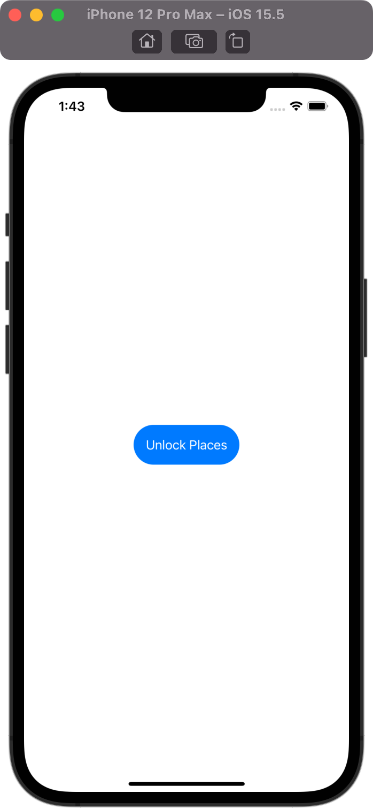

# BucketList

## Project Description

The project is a part of 100 Days of SwiftUI curriculum by Paul Hudson [Hacking with swift](https://www.hackingwithswift.com/100/swiftui)

The app lets the user build a private list of places on the map that they intend to visit one day, add a description for that place, look up interesting places that are nearby, and save it all to the iOS storage for later.
The app also uses biometrics at launch.

## Project Screen

      
